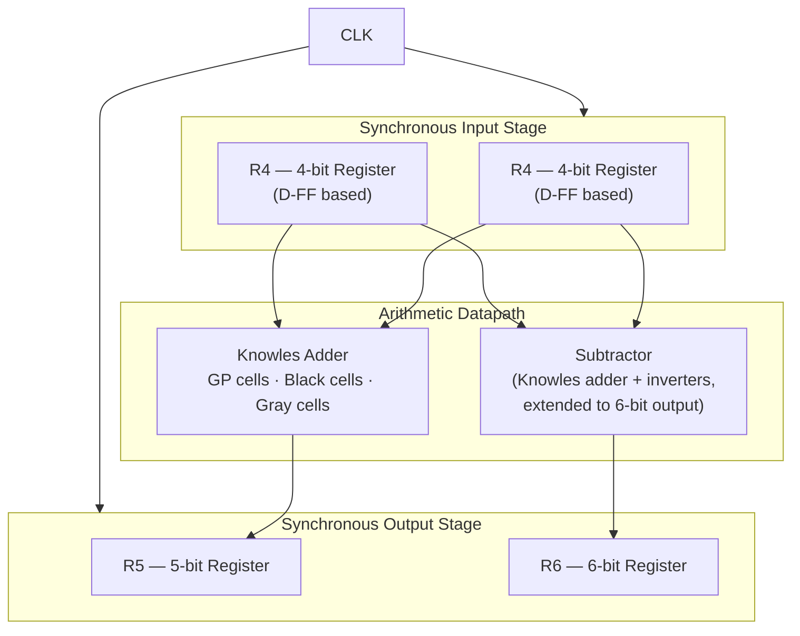

<div align="center">

# ALU — Full-Custom VLSI Design (gpdk45)

**From gate-level logic design to physical layout: a complete front-end-to-back-end VLSI flow in Cadence Virtuoso**


-34495E?style=flat-square)


*Tel Aviv University · Introduction to VLSI · Final Project*

</div>

---

## 📌 Overview

A complete **Arithmetic Logic Unit** designed and implemented full-custom in **Cadence Virtuoso** on the generic 45nm PDK (gpdk45), covering the entire flow:

**Logic design → schematic capture → floorplanning → physical layout → DRC → LVS**

The core arithmetic datapath is built around a **Knowles parallel-prefix adder** — a high-performance adder topology chosen for its balanced wiring and low fan-out — with synchronous register banks on inputs and outputs.

## 🏗️ Block Architecture



## 🧩 Cell Library (designed full-custom)

| Block | Function | Notes |
|---|---|---|
| **GP cell** | Generate/Propagate computation | First stage of the prefix tree |
| **Black cell** | (G,P) merge operator | Internal prefix-tree nodes |
| **Gray cell** | Final carry computation | Terminal prefix-tree nodes |
| **Knowles Adder** | Parallel-prefix addition | Assembled from GP/Black/Gray cells; full layout + routed inter-block connections |
| **Subtractor** | Two's-complement subtraction | Reuses the adder with inverters; output extended 5 → 6 bits |
| **R4 / R5 / R6** | 4/5/6-bit synchronous registers | D flip-flop based, clock-synchronized data capture |

## ✅ Physical Verification

| Check | Result |
|---|---|
| **DRC** (Design Rule Check) | ✅ Clean — layout meets all gpdk45 design rules |
| **LVS** (Layout vs. Schematic) | ✅ Clean — layout netlist matches schematic netlist |

## 🖼️ Design Gallery

| Schematics | Layout & Signoff |
|---|---|
|  |  |
| *Knowles adder — schematic* | *Knowles adder — physical layout* |
|  |  |
| *Subtractor (adder + inverters, 6-bit out)* | *Inter-block routing* |
|  |  |
| *GP cell — prefix-tree first stage* | *DRC run — clean ✅* |

**Full set in [`docs/screenshots/`](docs/screenshots/)** — all registers (4/5/6-bit), Black/Gray cells, LVS comparison, Quantus RC extraction, area & density report, and 14 simulation waveforms. Complete write-up: [`docs/alu-final-report.pdf`](docs/alu-final-report.pdf).

## 📁 Repository Structure

```
.
├── docs/
│   ├── alu-final-report.pdf  # Full design report (schematics, layouts, DRC/LVS)
│   └── screenshots/          # 33 captures: schematics, layouts, DRC/LVS, extraction, waveforms
└── README.md
```

> **⚠️ Note on design files:** the Cadence libraries and gpdk45 PDK files are **not** published in this repository — the PDK is distributed under license and the design database belongs to the university course environment. This repo documents the methodology and verified results; full design walkthrough available on request / in interview.

## 🔬 Skills Demonstrated

`Full-Custom Layout` · `Parallel-Prefix Adders` · `Floorplanning` · `Schematic Capture` · `DRC / LVS Signoff` · `Standard-Cell-Style Hierarchy` · `Cadence Virtuoso`

## 👥 Team

Jawad Saied Ahmed · Edwar Khoury · Weam Molem · Ahmad Foqara

---

<div align="center">

**Jawad Saied Ahmed** · [Portfolio](https://jawad-saied-ahmed.netlify.app) · [LinkedIn](https://linkedin.com/in/jawadsaidahmed)

</div>
