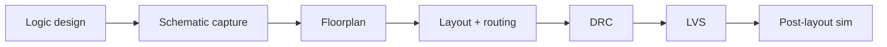
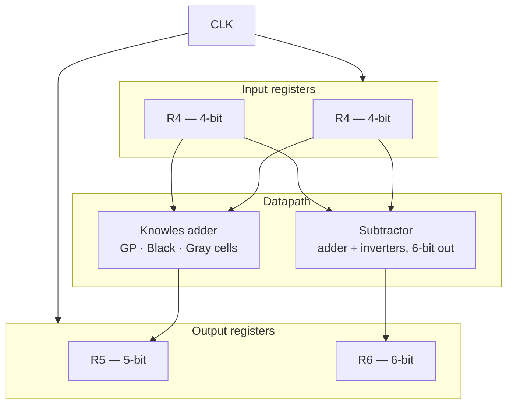
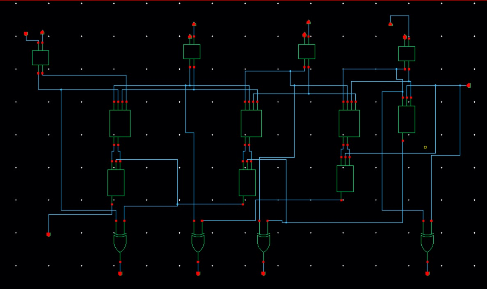
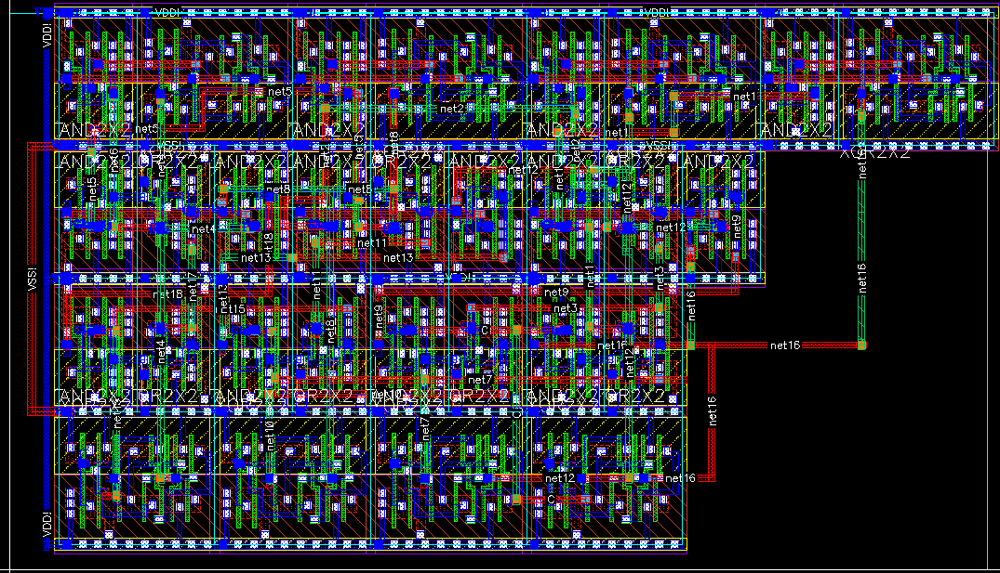
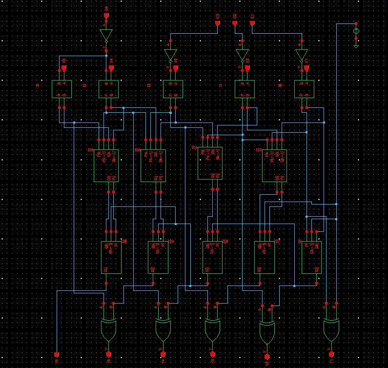
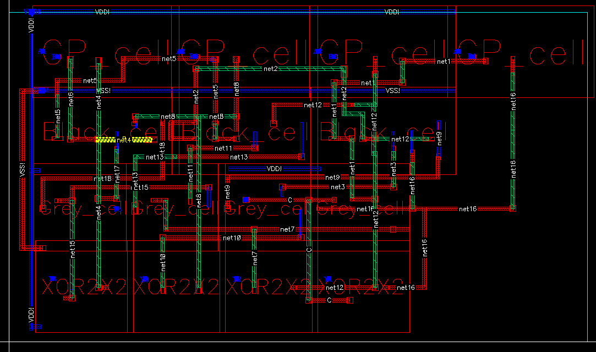
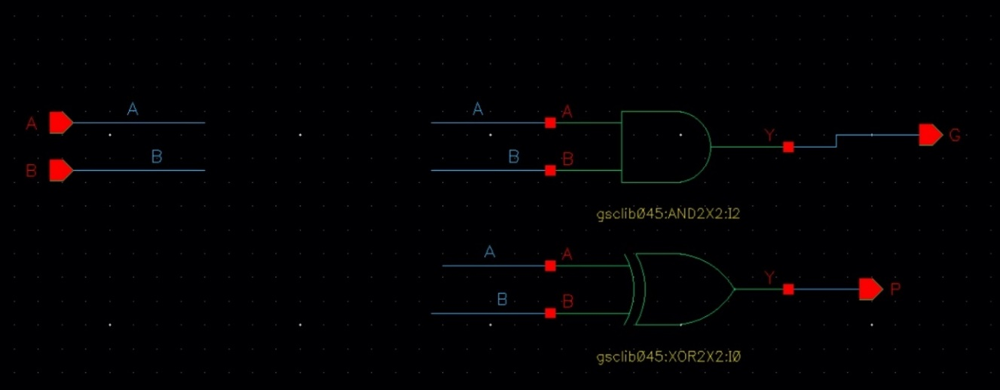
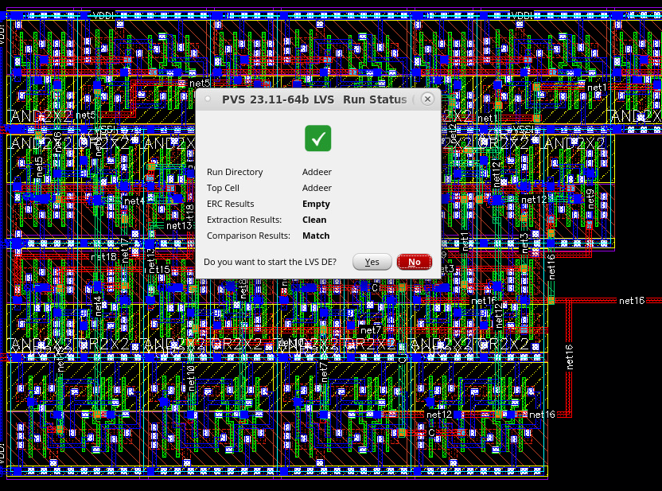
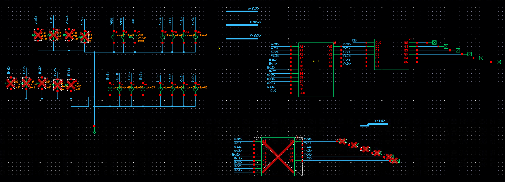
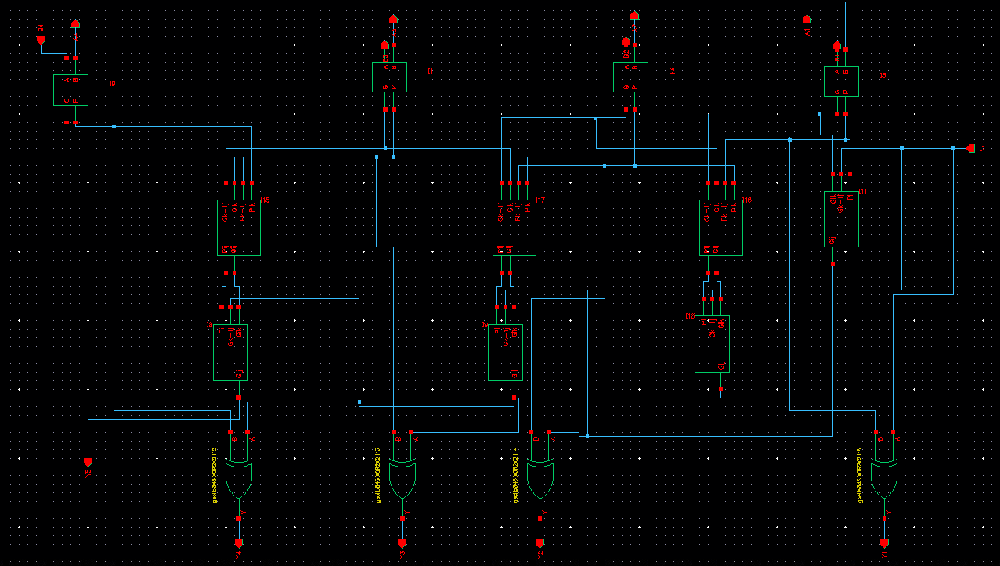

<div align="center">

# Full-Custom ALU in gpdk45

Gate-level design through physical layout in Cadence Virtuoso — schematic, floorplan, DRC, LVS.


*Tel Aviv University · Introduction to VLSI · Final Project*

</div>

---

## Overview

Team project: a complete **ALU datapath** built full-custom on the generic 45 nm PDK (gpdk45).

I worked through the full flow — logic design, schematic capture, floorplanning, layout, and signoff. The arithmetic core uses a **Knowles parallel-prefix adder** (balanced wiring, low fan-out) with synchronous register banks on the inputs and outputs.

A companion [AI verification co-pilot](https://github.com/jawadsa02/ai-verification-copilot) demo runs the same ADD/SUB/AND/OR/XOR checking methodology on a 4-bit ALU in the browser — [live demo](https://jawadsa02.github.io/ai-verification-copilot/).



## Datapath



## Cell library (designed in Virtuoso)

| Cell | Role |
|---|---|
| GP cell | Generate/propagate — prefix tree first stage |
| Black cell | (G,P) merge — internal tree nodes |
| Gray cell | Final carry computation |
| Knowles adder | Parallel-prefix adder, full layout |
| Subtractor | Two's-complement via adder + inverters |
| R4 / R5 / R6 | 4/5/6-bit synchronous registers |

## Signoff

| Check | Result |
|---|---|
| DRC | Clean |
| LVS | Layout matches schematic |

## Design gallery

<table>
<tr>
<td width="50%" align="center">
<br/>
<sub>Knowles adder — schematic</sub>
</td>
<td width="50%" align="center">
<br/>
<sub>Knowles adder — layout</sub>
</td>
</tr>
<tr>
<td align="center">
<br/>
<sub>Subtractor schematic</sub>
</td>
<td align="center">
<br/>
<sub>Inter-block routing</sub>
</td>
</tr>
<tr>
<td align="center">
<br/>
<sub>GP cell — prefix first stage</sub>
</td>
<td align="center">
<br/>
<sub>DRC — clean</sub>
</td>
</tr>
<tr>
<td align="center">
<br/>
<sub>LVS comparison</sub>
</td>
<td align="center">
<br/>
<sub>Full block layout</sub>
</td>
</tr>
</table>

**33 figures total** in [`docs/screenshots/`](docs/screenshots/) — registers, Black/Gray cells, Quantus extraction, area report, 14 simulation waveforms.

Full write-up: [`docs/alu-final-report.pdf`](docs/alu-final-report.pdf)

## Layout

```
.
├── docs/
│   ├── alu-final-report.pdf
│   └── screenshots/     # schematics, layouts, DRC/LVS, waveforms
└── README.md
```

> Cadence libraries and the gpdk45 PDK are not published here — the PDK is licensed and the design database lives in the university environment. This repo documents methodology and verified results.

## Team

Jawad Saied Ahmed · Edwar Khoury · Weam Molem · Ahmad Foqara

---

<div align="center">

[Portfolio](https://jawad-saied-ahmed.netlify.app) · [LinkedIn](https://linkedin.com/in/jawadsaidahmed) · [GitHub](https://github.com/jawadsa02)

</div>
